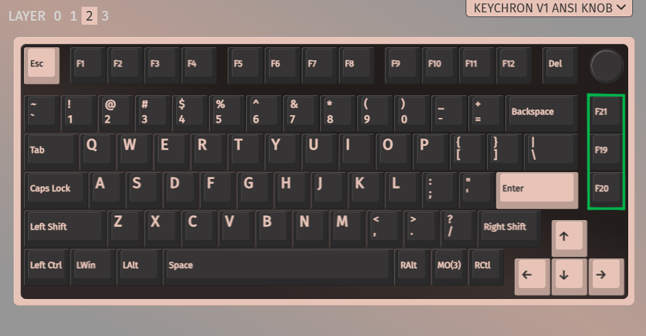
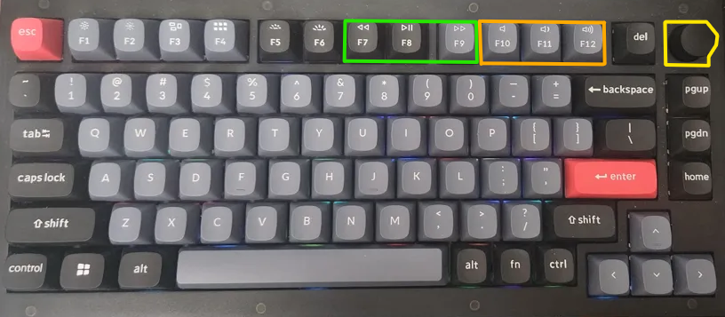
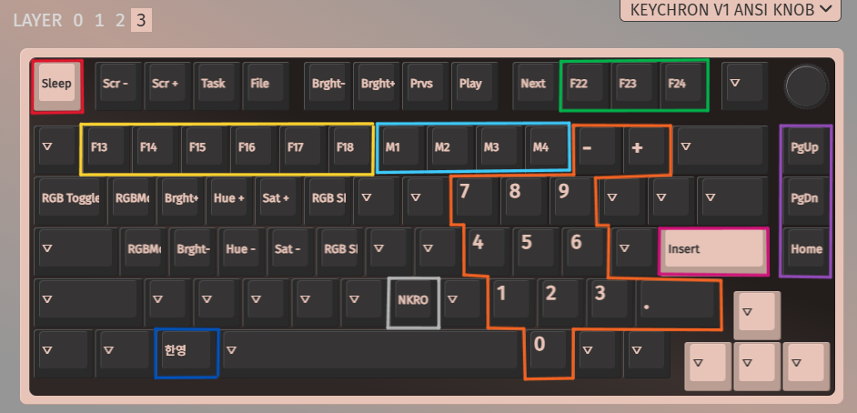

If you have a QMK or a compatible customizable keyboard,
you can take advantage of setting F13-24 keys that can
be programmed in AHK to do useful stuff when pressed.

This is what I personally use for my Keychron V1 (75% keyboard)

In this script I've set the hotkeys like so:
 F21:: YoutubeControl("{Right}")
^F21:: YoutubeControl("{l}")
 F19:: YoutubeControl("{left}")
^F19:: YoutubeControl("{j}")
 F20:: YoutubeControl("{k}")

Which in turn becomes:
       F21 = fast forward 5 sec
ctrl + F21 = fast forward 10 sec
       F19 = rewind 5 sec
ctrl + F19 = rewind 10 sec
       F20 = play/pause

Why those specific F keys?
You can use VIA or some other software compatible to add additional
F keys F12-24 on the fn layer.
If you map F12-F24 over F1-F12, for F7-F9 it's F20-F21.
On my keyboard I've replaced my pgup, pgdn, and home keys
into the config above.

On my 75% keyboard those are used for media playback keys, 
which some larger keyboards might have dedicated keys for.

When I hold my fn key, the keyboard effectively switches to layer 3,
which I remapped like so (highlighted keys are my configs, defaults unhighlighted)

It can get a bit confusing, but basically there are 2 distinctions:
1. The layout picture is the keyboard level settings where you config what
value a key sends when pressed. (VIA or your keyboard config software)
2. This hotkey script listens for specific key press values or modified ones 
(ex. Ctrl +, Shift +, Win +) to fire off code to do something useful when pressed.

Referring back to layer 2 and 3 setup I've shown, you only need to configure
on your keyboard the following keys for their hotkey functions:
global youtube playback - F19, F20, F21
global spotify playback - Media_Prev, Media_Play_Pause, Media_Next
global spotify volume   - F22, F23, F24

The k75 version of the script provides these following hotkeys:
              F21 = yt fast forward 5 sec
       ctrl + F21 = yt fast forward 10 sec
              F19 = yt rewind 5 sec
       ctrl + F19 = yt rewind 10 sec
              F20 = yt play/pause
       Media_Prev = spotify skip to previous
ctrl + Media_Prev = spotify seek backward
 Media_Play_Pause = spotify play/pause
       Media_Next = spotify skip to next
ctrl + Media_Next = spotify seek forward
              F22 = spotify like/unlike song
              F23 = spotify lower volume
              F24 = spotify raise volume
       ctrl + F22 = system volume mute toggle
       ctrl + F23 = system volume down
       ctrl + F24 = system volume up
*depending on which layer you mapped the key on your keyboard, 
you may have to additionally hold fn to activate the correct hotkeys.

